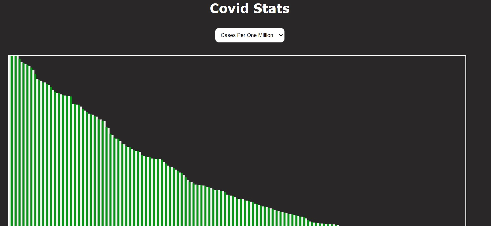

Covid-Stats
Covid-Stats is a simple web application that provides statistics and data visualization for COVID-19 cases worldwide. It allows users to view and compare COVID-19 cases in different countries using bar charts.

Demo
You can access the live demo of the project at https://aneal07.github.io/Covid-Stats/

Features
Displays COVID-19 statistics for different countries.
Provides a bar chart visualization of COVID-19 cases per one million people.
Allows users to hover over the bars to view country-specific data.
Data is fetched from the disease.sh API.
Technologies Used
HTML
CSS
JavaScript
React.js
D3.js
Usage
Visit the Covid-Stats website.
The homepage displays a bar chart showing COVID-19 cases per one million people in different countries.
Hover over the bars to view the country name and the corresponding number of cases per one million people.
Use the scrollbar to navigate and explore additional countries.
